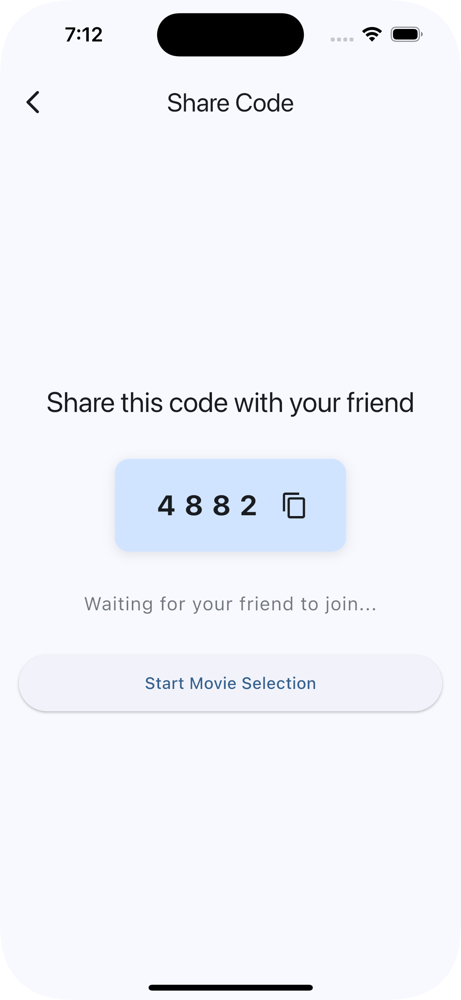
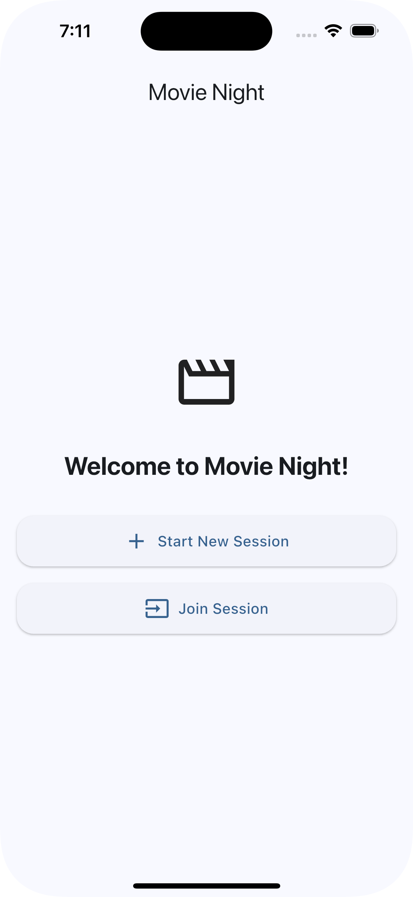
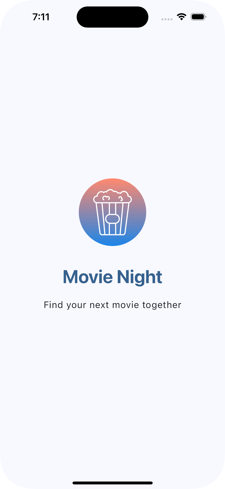
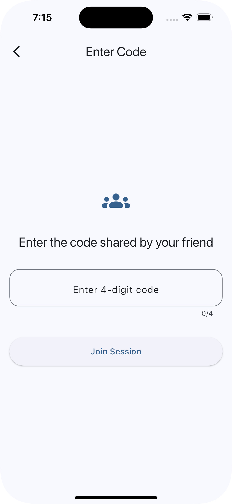

# 🎬 Movie Night App

Hey fellow movie enthusiasts! 👋 This is Movie Night - a fun little app I built to solve that age-old problem of "What should we watch?" You know, that eternal debate that eats up half your movie night? Yeah, that one.

## 📱 Screenshots

<table>
  <tr>
    <td></td>
    <td></td>
    <td></td>
  </tr>
  <tr>
    <td></td>
    <td></td>
  </tr>
  <tr>
    <td colspan="3" align="center"></td>
  </tr>
</table>

## 🤔 What's This All About?

Ever tried to pick a movie with someone and ended up spending more time choosing than watching? Movie Night makes this super easy:

- One person starts a session and gets a code
- Their friend enters that code
- Both swipe through movies (Tinder-style, because why not?)
- When you both like the same movie... BOOM! 🎉 It's a match!

## 🛠️ Tech Stuff (for my fellow nerds)

Built this bad boy using:

- Flutter (because cross-platform is cool)
- MVVM architecture (keeping it clean and organized)
- TMDB API (for all that sweet movie data)
- Movie Night API (handles the matching magic)

## 🚀 How to Run

1. Clone this bad boy:

```bash
git clone [repository-url]
cd movie_night
```

2. Get the dependencies:

```bash
flutter pub get
```

3. Fire it up:

```bash
flutter run
```

## 🎮 How to Use

1. First person:

   - Hit "Start New Session"
   - Get a 4-digit code
   - Share it with your friend

2. Second person:

   - Hit "Join Session"
   - Enter the code
   - Start swiping!

3. Both:
   - Swipe right for movies you like
   - Swipe left for... well, you know
   - Wait for that sweet match notification!

## 🤓 Cool Features

- Real-time syncing between users
- Infinite scroll through movies
- Nice animations (because we're fancy)
- Dark mode support (for late-night browsing)
- Smooth like butter UI

Made with 💙 and probably too much caffeine. Happy watching! 🍿
